# vsd_IAT_openlane_workshop

It contains the material that was presented and learned in a 5 day workshop from 25 to 29 November conducted by Kunal Ghosh, co-founder of VLSI System Design (VSD) Corp. Pvt. Ltd. 

# Contents:

* [Day 1](#Day-1:)
* [Day 2](#Day-2:)
* [Day 3](#Day-3:)
* [Day 4](#Day-4:)
* [Day 5](#Day-5:)

# Day 1:

The main learning objective of Day 1 are:

1. Getting familiarize with the terminology like core, package, IPs, Macros, Foundry.
2. A brief introduction to computer architecture, RISCV architecture, and how an application like stopwatch code in a high-level language is converted into binary language to be executed on hardware.
3. The 3 requirements to build an ASIC
4. The simplified RTL to GDSII flow 
5. Introduction to openlane
6. Passing the picorv32a design through the openlane flow and analyzing the synthesis result.

## Understanding:

### Termanologies:

#### Core:
When different small components like ALU, Registers, Instruction fetch are interconnected together to make a single block then that block is a core.

#### IPs:
When someone has used its intelligence in building an RTL design then that RTL design is an IP.
#### Macro:
The single-component of a large design is called macro.

#### Foundary:
A place where a digital design is manufactured.

The follownig snapshot shows different things in a package:

Top view of package         |  Internal of package
:--------------------------:|:-------------------------:
| 

### From software to hardware:

An algorithm is implemented in high level language like a code of sorting the number in decreasing order written in C++. This code written in a high-level language is given to the compiler which converts it into instruction, the syntax of these instruction depends upon the type of architecture that is used to develop the hardware. For example, in our case, RISCV architecture is used to write the RTL code from which the hardware is developed. The instruction from the compiler are fed to the assembler which convert them in binary number and these binary numbers are passed to hardware which do the working and display the result of written code. The below diagram shows this flow:

#### Requirements to build ASIC:

The three basic components required to build the ASIC are 

1. RTL code written in any HDL language 
2. EDA tools required to do the analysis, optimization, and generating the required files for the foundry
3. Process design kit PDK.
Now a days, there are a lot of open sources like opencores.org to get the RTL code, OpenLane for EDA tools, but for PDK there is only skywater-130 from skywater is available as open source. 

#### Simplified RTL to GDSII flow:

The following diagram shows the step from a design written in HDL to generate the GDSII file required by the foundry to build the physical layout

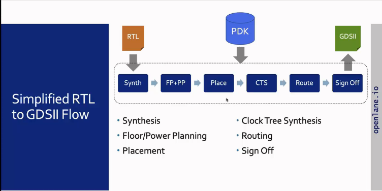

* Synth (synthesis)-> The standard cell library is used to convert the RTL code into a circuit.

* FF+PP (Floor and Power Planning) -> Planning the silicon area and develop the power distribution network.
* Place (Placement) -> Placing gate-level netlist on virtual rows. It is done in 2 steps Globel (optimal placing without any rules) and Detail (making global real by following rule with minimum alteration)
* CTS (Clock Tree Synthesis) -> Creating the clock distribution network following a structure like H, X hybrid of both H and X, etc.
* Route (Routing) -> Connecting the cells through the horizontal and vertical wire network
* Sign Off -> Making sure that layout and schematic are the same and performing the static timing analysis.

### OpenLane:
Openlane is an open-source tool that encompasses the open-source EDA tools to automate the flow from RTL to GDSII. it has public repo on Github. The below diagram shows the complete flow of Openlane.

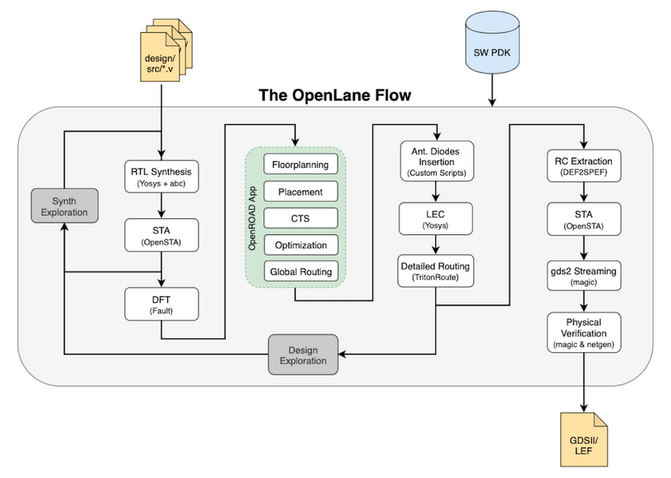

The flow starts by feeding the RTL files with design constraints to yosys which translates it to into a logic circuit using generic components and then abc maps this circuit to cells. The OpenSTA do static timing analysis. Then OpenRoad apps are used to do the physical implementation. Again yosys is used to do the logic equivalence check (LEC). In the last, the static time analysis, design rule checking, and layout vs schematic checking is performed.

### Lab:
The lab task was to explore the directory structure of the openlane, take the picorv32a design, and pass it through the Oplenlane flow, and analyze the synthesis reports. The following blow diagram shows the synthesis report form which the flop ratio is calculated by dividing the number of flip-flops by the number of cells. Similarly, the total area can also be seen in the report

The below screenshots is showing the static timing time analysis and the result is confirming that the time requirements are met.

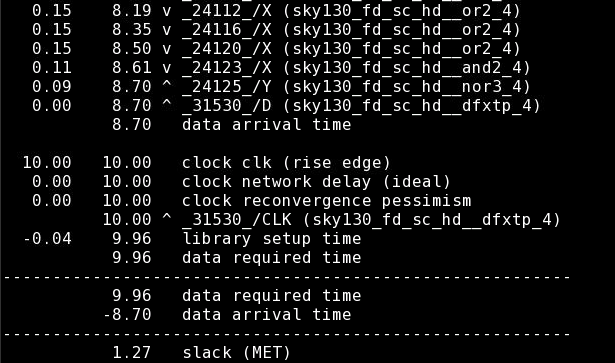

# Day 2:

In Day 2, the following concepts are introduced:

* Utilization factor and Aspect Ratio
* Pre-placed Cells
* De-coupling capacitor
* Ground bounce and voltage drop and power mech
* Pin placement
* Binding netlist with physical cell and doing optimization for signal integrity
* IC Design Flow
* Lab (doing floorplanning with different configurations)

#### Utilization factor:

It is the ratio of the area occupied by netlist to the area occupied by the core. 

Netlist means the logic circuit drawn using symbols like AND gate, OR gate, flipflop, etc. The core means the area on silicon fiber. For calculation, we assume the proper shape of each item in the netlist.

It tells us how much area netlist is occupying in core. If this ratio is 1, it means that the netlist has occupied all the core.

#### Aspect Ratio:

It is the ratio of height of core to width to core.

This ratio tells us the shape of the core. For example, if this ratio is 1 then the core has a square shape.

#### Pre-placed cells:

In chip design most of the time we are using the same logic like memory, mux, again so for these kinds of logic we already have cells ready to give this functionality. These cells are called pre-placed cells    

#### De-coupling capacitors:

In the logic gate circuitry, the current required for the transition from high to low or low to high logic is supplied by a voltage source. The current from the voltage source to logic gates is reached via wires. These wires have resistance and inductance. So the current supplied by the voltage source is less than the current received by logic circuitry and there is a huge possibility that the amount of current even falls below the requirements for the transition. So to overcome this problem, a capacitor in parallel to the voltage source and close to the logic circuit is placed. This capacitor is charged by the voltage source and then supplied the required current to the logic circuit as shown below:

#### Ground bounce:

In a logic circuit when all the transistors have common ground, so if many transistors at the same time go to logic low then they discharge all their charge to the same ground so there is a voltage bump on the ground side called as ground bounce.

#### Voltage drop:

In a logic circuit when all the transistors have a common voltage source, so if many transistors at the same time go to logic high then they all pull the charge from the source at the same time so there is a drop in voltage called voltage drop.
 
#### Power mesh:

To avoid the voltage drop and ground bounce problem, instead of having a single voltage source and common ground, a mesh-like structure is layout so that each transistor can get voltage from the nearest source and can discharge to the nearest ground as shown below:

#### Pin placement:

In pin placement, we determine all the input and output ports of our netlist. If there are the same ports like clock port then they are tied together to make a single clock port, from this we get to know the number of input and output pins of our core. All the blocks of netlist are placed in such a fashion that the input or output pin of the respective input or output port is closed and easily connected.

#### Binding netlist with physical cell and doing optimization for signal integrity:

To present every element of the logic circuit in the virtual world, it is considered a box which has certain dimension and properties like delay time required condition to perform its functionality, etc. All this information is placed in a file that is called a library file. This library file can have different flavors to have different information for the same kind of element. 

When we placed the element of netlist in the core then some elements are very far and wire is used to make the signal travel from one element to another. Due to the large length of wore, there is a chance that signal from the sender does not receive that is signal integrity does not retain so to avoid this we used repeaters at the appropriate distance.

#### IC design flow:

Basic IC design flow has the following steps:

1. Write an HDL code according to the given specifications and do the logic synthesis to convert the code into netlist
2. From the netlist, do the floorplanning using a tool and do the optimization to attain the signal integrity.
3. Place the standard cells from the library file.
4. Do the clock tree synthesis
5. Routing
6. Do static timing analysis and generate the GDSII file for the foundry.

#### Lab (doing floorplanning with different configurations)

For floorplanning, the picorv32a design is first synthesized and then the following command is used to do the floorplanning.

                       % run_floorplanning

These commands will print the following message on terminal

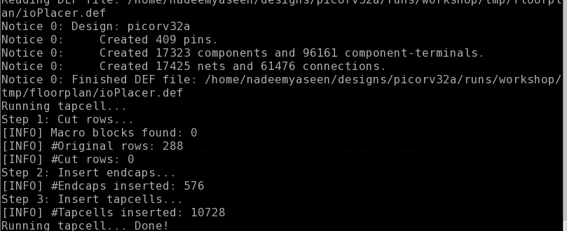
            
The generated `.def` file in `/runs/<custom name>/results/floorplan` is like:

The magiclayout tool is run by command:

                        $ magic -T <.tech> lef read <.lef> def read <.def>
                        
And it has shown the following layout:

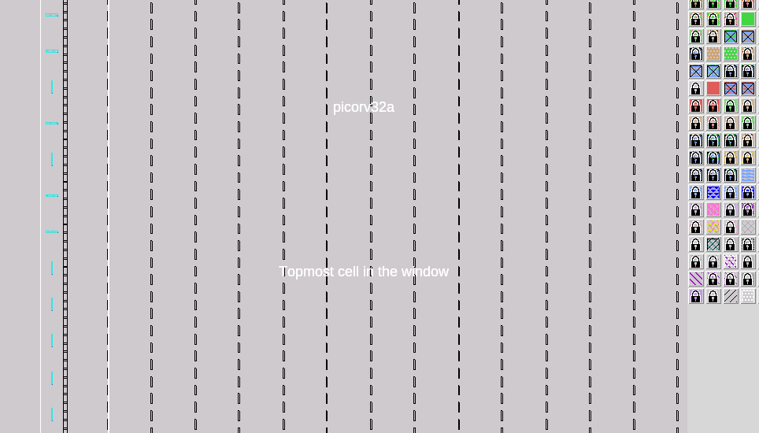
            
During the synthesis, floor planning, and other steps of OpenLane, several flags mentioned in `/openlane/configuration/README.md` can be given
3 configuration files are used during the OpenLane flow. These configuration files has the following order:

sky130A_sky130_fd_sc_hd_config.tcl > config.tcl > floorplan.tcl

The following command is used to make the result directory of custom name

                       % prep -design <design name> -tag <custom name>
                       
This will save the result and will **not** over-write the result for a step once done. I want to overwrite the changes then use the flag `-overwrite`.

If we done step like floorplanning and want to change some of the configuration for the same step then first locate the variable in configuration files and do

            % set <copy variable from config file> <new value>

And then

            % <run the command of step again>

# Day 3:
Thi day is about designing a library cell using 2 tool i.e. Magic Layout and ngspice.

#### Spice simultion step:

The first step is the preparation of Spice Deck which involves the following things

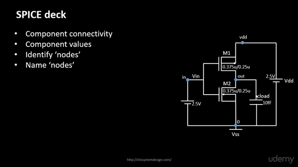

Then from this information, a spice simulation file is written for static and transition analysis. This file is passed to ngspice tool and simulation is run to draw the waveform. From the static analysis simulation waveform, we can zoom in to see threshold voltage and from the transition analysis waveform, the rise and fall times can be calculated.

#### 16-mask CMOS process:

The is the process of physical implementation of CMOS inverter.

**Steps:**

1 Selecting a substrate. Substrate is a material on which a chip is fabricated.

2. Creating the active region for transistors. The region of the substrate where PMOS and CMOS are placed. 

3. N-well and P-well formation.

4. formation of gate.

5. Lightly Doped Drain formation.

6. Source drain formation.

7. local interact formation.

8. High metal formation.
  
The below diagram shows the result of the above steps
  
  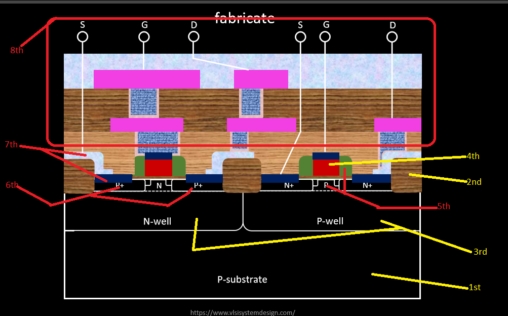

# Lab

Following the step on this [github link](https://github.com/nickson-jose/vsdstdcelldesign) the following inverter layout is obtained
  
   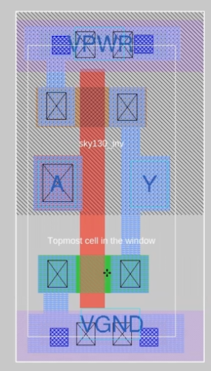
  
After this, extracting the file for spice simulation using the commands

            % extract all
            % ext2spice cthresh 0 rthresh 0
            $ ext2spice

After Modifying the extracted file, it looks like this
  
  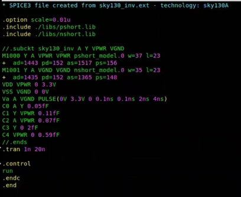

Run the spice with command in clone directory

          $ ngspice <extracted file name>.spice

To see the output run this command in ngspice terminal
  
          ngspice 1 -> plot y vs time a
 
It will display the following kind of waveform:

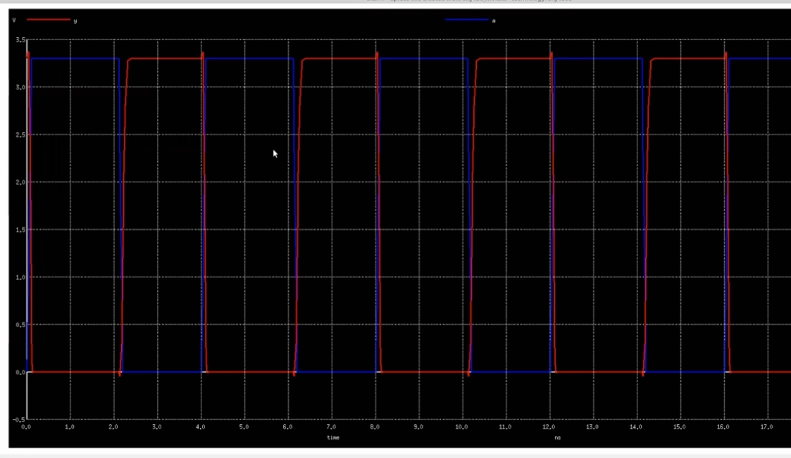

# Day 4:

The concept of setup timing analysis and how to do it in OPenSTA is taught. 

* Delay table is drawn between the input slew (input transition time in ps) and output load (capacitance) and shows that how much time is taken by a cell to drive the certain load.

* Setup timing analysis

Setup Time is the time required by flip flop to settle its input
Jitter refers to the window within which the clock edge can arrive on a real chip. It is the temporary variation of the clock period. It is also referred to as uncertainty

From above we can say that the total period is like

           time taken by combinational logic and clock to Q time of flip flop < (total clock period - setup time - uncertainty)

* Real-time scenario 

In the chip, different elements are at different distances from the clock pin so the clock signal needs to cover different distances to reach a particular element. So this will make the clock signal time different for elements and referred to as skew. This skew should be kept close to zero and it is achieved by applying different techniques like H-tree etc and repeaters to maintain the signal integrity. To avoid the cross-talk problem we shield the network of the clock. Now due to these buffer, the time required for the signal to reach flop is 

time taken by combinational logic + clock to Q time of flip flop + sum of all buffer in a way from clock to launched flop < ({total clock period + sum of all buffer in a way from clock to captured flop} - setup time - uncertainty)

  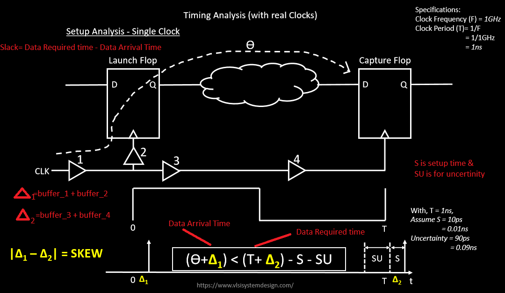

#### Lab

This lab is about how to use our custom make cell in OpenLane flow. The inverter layout in magiclayout tool that was used to extract the spice deck to do the spice simulation is on day 3 is now used to make a lef file. This lef file will contain the information of boundary, power and ground rates, and input & output ports. To extract the lef life a certain guidelines have to be followed. For example, input and output ports must lie at the intersection of vertical and horizontal tracks. The width of the standard cell should be an odd multiple of horizontal track pitch and height should be an odd multiple of vertical track pitch. So to meet this guideline we used the `pdks/sky130A/libs.tech/openlane/sky130_fd_sc_hd/tracks.info` file to set the grid parameter of magiclayout tool grid using the command:

To check the parameter that grid command accept use:

                    % help grid
                    
And then from the `track.info` file plugin in the values

                    % grid 0.46um 0.34um 0.23um 0.46um
                    
The below figure shows the grid before and after the execution of the command:

  Before the command execution                                     |  After the command execution
:-----------------------------------------------------------------:|:-------------------------:
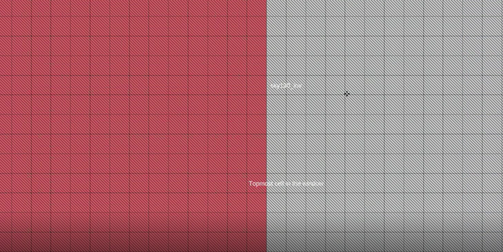| 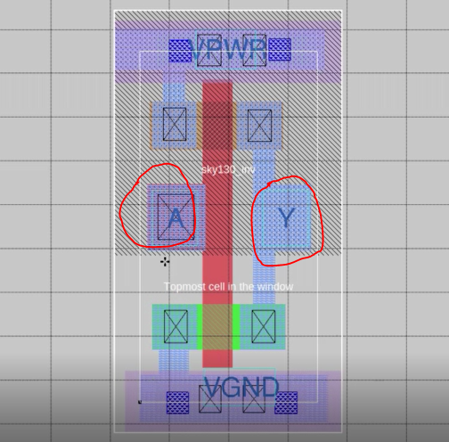

Follow the other instruction on the Github link to set the input/output and ground/power ports.

Now save the cell with a custom name using the command

                  % save <custom_name>.mag
                  
Then open this save file using the command

                 $ magic -T sky130A.tech <custom_name>.mag &
               
Then in the TCL shell of magic run this command

                 % lef write
               
This will make a lef file having content like this:

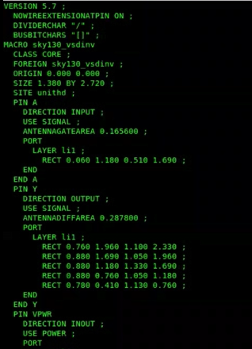

Now copy this file and the sky130 library file present in lib folder of [github clone directory](https://github.com/nickson-jose/vsdstdcelldesign) into `/design/src` directory. Modify the `/openlane/designs/<design name>/config.tcl` according to the Nickson Github repo. Run the OpenLane in interactive mode, do the design preparation stage then execute the commands as given in repo to tell the OpenLane to include our lef file. Then running the synthesis will include our lef file. Then running the floorplanning step will make include our cell file in `<design name>/runs/<custom folder name for results>/temp/mergered.lef` file. We can load the tech file and this lef file with the magic tool and can check the placement of our cell.

#### Using OpenSTA:

To run the OpenSTA tool first do the synthesis and then write a configuration file for OpenSTA in `openlane` directory like this

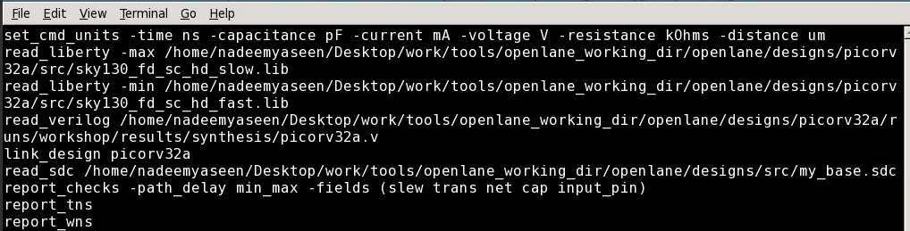

And then the STA analysis

             % sta <sta config file>

These commands will report the slack time like

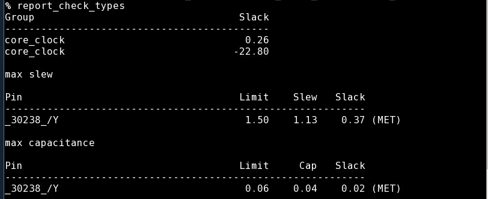

To write the netlist  generated by OpenSTA to Verilog file, execute the following command in OPenSTA TCL shell 

                    % write_verilog <directory where OpenLane place its syntheis file i.e. /openlane/designs/<design name>/runs/<custom name of results>/results/synthesis/<file name like Openlane used>>
            
This will overwrite the file present there.
Now the CTS is done using the below command in OpenLane flow

                   % run_cts
                   
It will display the following on terminal

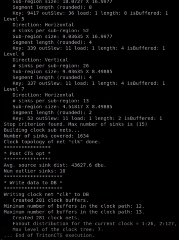

# Day 5:

This day is about routing, its algorithm, and design rule checking (DRC)

Routing in physical design means connecting the 2 points through the best and shortest path.
One of the famous Routing algorithm is [Lee's algorithm](https://www.vlsisystemdesign.com/maze-routing-lees-algorithm/) for maze routing.

#### Lab

This day lab is creating a power distribution network and routing.

After the CTS is done, run the below command in interactive mode of OpenLane to generate the power distribution network.

                         % gen_pdn
                         
It will print the below,

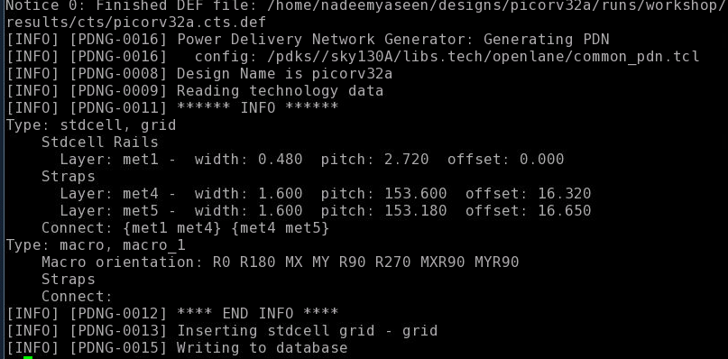

After this, routing is done using the command,

                     % run_routing
# Acknowledgement

* Kunal Ghosh, Co-founder, VSD Corp. Pvt. Ltd

* Openlane team, Efabless corporation

* Philipp Gühring, Developer at Falcontrol

* Nickson Jose, VLSI Engineer
